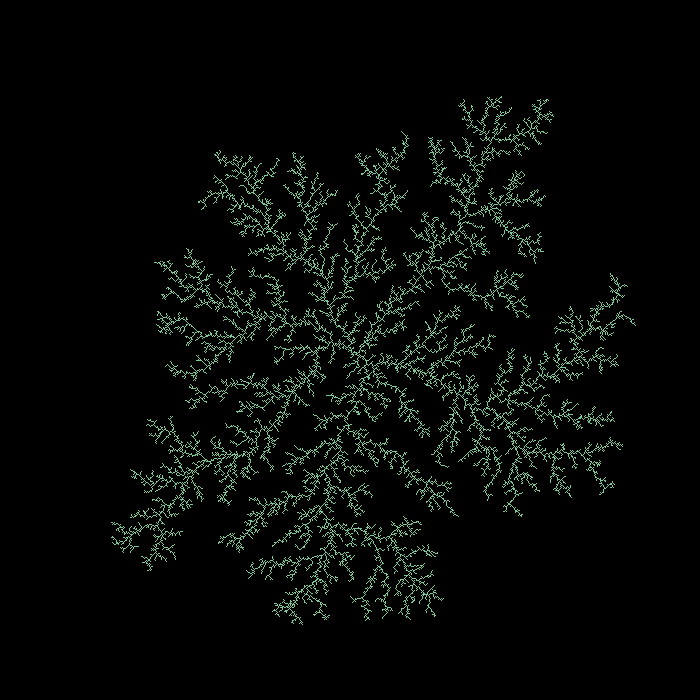

## Diffusion Limited Aggregation ##

Let us call a computation dual to *purely functional*, *maximally-stateful*.
A maximally stateful process is one whose side-effects dominate the computation,
with little else analytically calculable. The image is that of clouds,
cellular automata, or the geological history of a mountain. Consider computations
where: the term process is more apt than function, computations whose
specification may be trivial and yet depend crucially on their initial
conditions, the evolving process manifests in bouts of combinatorial explosions,
the intension matters more than the extension, and any particular run is
unambiguously path-dependent.

Some time ago, my friend, Glen mentioned diffusion-limited aggregation
(DLA) in the context of our on-going discussions centered around modal
logic, determinism, and epiphenomena. Glen suggested DLAs as an example
of where the conceptual cleanliness of algebraic thinking, categorical
thought, and purely functional programming may be disadvantageous to the
reasoner. Part of his criticism focuses on insufficient characterization
by way of Poset-centric descriptions. Inspired by Glen's skepticism, I
set out to explore what forms purely functional diffusion-limited
aggregation may take. To a first approximation, the computation may
be understood as a function taking a pair of lists to a pair of lists,

`DLA1 :: ([Free], [Bound]) -> ([Free], [Bound])`,

where Free and Bound are type synonymous with a general particle type.

Initially, the collection [Bound] consists of stationary germs and the
collection [Free] consists of random walking particles. As freely moving
particles enter the neighborhoods of bound particles, the free particles
themselves become bound. Functionally, we can interpret the function as a
process taking elements from the left list to elements of the right list.
However, if this were all the was to say about the problem then we could
be done with it and simply write:

`DLA1 (fs, bs) = ([], fs ++ bs)`

However, this isn't the case. We want more from a DLA, namely its state.
We are not just concerned with the fact that free particles become bound,
but with how these particles become bound, the intensional content of the
computation, its stateful nature. Further, we may concern ourselves with
sensitivity to path-dependence, the manifested form's being and becoming
as a historical fact.

To address these questions consider a dual interpretation. Rather than
considering random walks on free particles, we can assign probability
distributions to the bound particles (the surface-bound particles having
non-zero probability). At every time step, each cell has some probability
of capturing a free particle, and the collection of bound particles
grows in this way[*]. As the surface changes, the distributions over the
entire surface are recalculated, and from this perspective, it is clear
that the combinatorial species determines future probabilities. To my
mind, this treatment begs the question, "What might be gained from
structuring the space of all possible bound states as a Poset"? In this
interpretation, any DLA can be given extensionally as a path (really a
lattice of 'evolutions satisfying boundary conditions') from some germ
state to some final state.

From a purely functional perspective, it is natural (since Moggi) to
structure stateful computations in terms of monads and free algebras[▢].
There are a number of ways that monadic interpretations may arise in
this context: The State monad to accumulate data separate from function,
the Giry monad to structure a Markov transition system, or perhaps a
monadic pointed space to structure the encapsulation of bound particles.
While the first two are likely essentially-necessary, the last points to
tempting but possibly exogenous interpretation. How does one know when
they have accurately characterized the content of a theory? How does one
know that there is nothing more to be gleaned?

[*] It is worth noting that to reach an analytically amenable form, I
was initially tempted to replace probability distributions by growth
rates over bound particles. Unfortunately, models of this type fail to
exhibit the symmetry breaking characteristic of DLAs. For example,
consider a computation beginning with a single germ, each side of which
is given the same probability and thus the same growth rate.

[▢] The relationship between the usage of monads in computer science
(for structuring programs or handling side-effects) and the usage of
monads in mathematics (for founding algebras) remains mystifying to me.
To my naive eye, it appears as one of those unlikely places where a thing
and the language for talking about the thing identify, but who knows?

- wikipedia: https://en.wikipedia.org/wiki/Diffusion-limited_aggregation